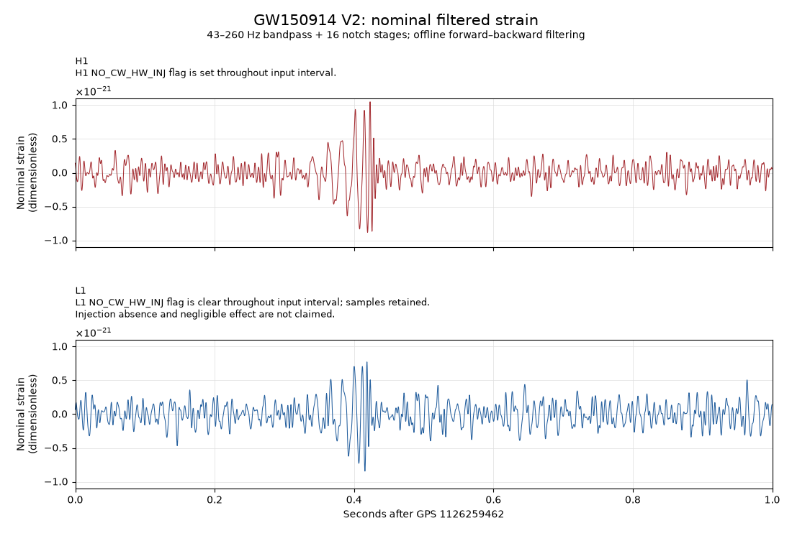

# RI-47 — nominal public V2 crop and display

24 September 2026 UTC. **Independently accepted nominal public-data result.**
The exact qualified V2 pair has been processed and rendered with the frozen
recipe. Normal and optimized execution produced byte-identical exports and
PNGs. This is a conventional nominal strain display, not a new detection or
a native gravitational prediction. Actual evidence and artifacts follow below.

The frozen [RI-42 recipe](../gwosc_nominal_display_v1/RECIPE.md) defines the
observable and operations. [RI-44](../gwosc_nominal_processing_v1/PROCESSING.md)
admits their synthetic numerical implementation and coefficient manifest,
SHA-256 `700b2c2f0e339df4a003ee7d772917cf243d8e3ffdbb90d087c9044bee42e3a0`.
The numeric consumer, [process.py](process.py), must verify those published
dependencies and both complete pinned public V2 byte snapshots before HDF5
parsing. It must reuse the accepted schema/flag inspection on the same bytes,
apply the admitted coefficients in the qualified filtering runtime, and retain
exactly indices `[65536:69632]` of each 131072-sample output. Filtering is
offline, stagewise and forward–backward; no other crop or processing choice
is introduced here.

## Export and renderer boundary

The numeric export uses schema `ri47-nominal-strain-crop-v1`, with ordered H1
and L1 entries, 4096 canonical finite binary64 `float.hex` samples per detector,
and each crop's C-order little-endian binary64 SHA-256. It includes both input
identities, the recipe/coefficient pins, the fixed integer grid, and complete
RI-37 quality/injection metadata and missingness records. Additional provenance
objects may accompany this core. The renderer requires the exact fixed grid,
input pins, crop byte identities and complete annotation identities; its check
does not independently prove that a producer applied the claimed filter. That
assurance belongs to the separately reviewed and replayed numeric consumer.

[render.py](render.py) reads only the exported JSON snapshot. It imports no
filtering module and opens no observed HDF5 input. Its x coordinates are exactly
`j/4096`, for `0 <= j < 4096`, seconds after GPS `1126259462`. It plots the
decoded strain values directly, without numeric rescaling, in vertically
stacked H1 and L1 panels. Both panels share symmetric amplitude limits extending
five percent beyond the largest absolute displayed value. The all-zero case
uses limits `[-1,1]`; unrepresentable finite limits cause refusal. All 4096
points per detector are supplied to Matplotlib, with path simplification
disabled and no clipping. Scientific tick notation is only axis formatting.

The visible H1 annotation states that its `NO_CW_HW_INJ` flag is set throughout
the input interval. The L1 panel visibly states:

> L1 NO_CW_HW_INJ flag is clear throughout input interval; samples retained.
> Injection absence and negligible effect are not claimed.

The complete annotation objects are pinned independently of the sample values.
They copy `data_quality`, `hardware_injection_flags`, `warnings` and
`missing_and_excluded_by_DATA` from the published
[RI-37 report](../gwosc_input_qualification_v1/INPUT_REPORT.json), adding the
literal `cw_display_annotation`. Their canonical ASCII JSON SHA-256 values are
`da67bb7ba8e4bd7638cb04872e0f52dec06531099dbf1e3db6d25f3c5db337d2` for H1 and
`109d1ffec046b36e7fab31811fc6240b40f92250a47dc16c3359482869335515` for L1.
This preserves the clear L1 flag and all other supplied annotations; it supplies
no additional injection-effect assessment.

## Reproduction

Numerical processing uses RI-44's separate, qualified CPython 3.11.6 / NumPy
2.1.3 / SciPy 1.14.1 / h5py 3.12.1 environment. Rendering uses CPython 3.11.6
and [Matplotlib 3.11.1](RENDER_REQUIREMENTS.txt). Rendering's NumPy, Pillow,
FreeType, platform and backend versions are recorded independently; they are
not represented as the qualified filtering runtime. Root provisions and selects
environments. Do not install rendering dependencies into the filtering environment.

The numeric consumer takes the already qualified public-pair directory and a
new output leaf outside all Git checkouts. The output leaf must not exist; its
parent must exist. After all admission/input/processing checks, it writes exactly
`CROP.json` and `PROCESSING_REPORT.json` and emits a deterministic JSON identity
summary to stdout. Replay to two separate external leaves:

```sh
/absolute/path/to/qualified-env/bin/python -I -B \
  docs/experiments/gwosc_nominal_result_v1/process.py \
  --input-dir /absolute/path/to/qualified-pair \
  --output-dir /absolute/path/to/new-normal-output \
  > /absolute/path/to/process-normal.json
/absolute/path/to/qualified-env/bin/python -I -B -O \
  docs/experiments/gwosc_nominal_result_v1/process.py \
  --input-dir /absolute/path/to/qualified-pair \
  --output-dir /absolute/path/to/new-optimized-output \
  > /absolute/path/to/process-optimized.json
```

Compare both exported files and complete stdout across modes before rendering.
After the numeric consumer has produced and verified the crop export, the
renderer commands are:

```sh
/absolute/path/to/render-env/bin/python -I -B \
  docs/experiments/gwosc_nominal_result_v1/render.py \
  --crop /absolute/path/to/CROP.json --output /absolute/path/to/normal.png \
  > /absolute/path/to/render-normal.json
/absolute/path/to/render-env/bin/python -I -B -O \
  docs/experiments/gwosc_nominal_result_v1/render.py \
  --crop /absolute/path/to/CROP.json --output /absolute/path/to/optimized.png \
  > /absolute/path/to/render-optimized.json
```

Use different, nonexistent output paths. Exclusive output creation refuses an
overwrite. Validation failures return nonzero with stderr and no success JSON;
invalid crop inputs produce no PNG. Successful stdout is a JSON render record
containing crop/PNG/source identities, the separate rendering runtime, fixed
display settings and plotted crop identities. Record actual commands and modes
externally. Compare the two PNGs and complete render-record bytes, then visually
inspect both detector panels, units, fixed time axis, shared scale and warning.

The Agg PNG has fixed dimensions, font, layout and text metadata, with no embedded
timestamp or output path. Matplotlib configuration and font-cache files use a
temporary external directory. Its informational font-cache progress message may
appear on stderr during a successful run. Byte reproducibility must be checked
in the actual rendering environment; no cross-platform/font-rasterization identity is promised.

Root must first review both sources, verify all dependency pins, and replay the
consumer in normal and optimized modes from isolated copies. It must reconcile
the numeric export and processing report, confirm unchanged original snapshots,
then generate and inspect the display. Synthetic renderer checks can exercise
schema refusals, identical PNGs across modes, signed-zero preservation, shared
limits and the visible annotations without observed strain access. The completed source reviews, actual replays
and artifact reconciliation are recorded below.

## Interpretation

The accepted result is nominal dimensionless strain after the frozen
43–260 Hz bandpass and 16 notch stages. It includes no whitening, fitted shift,
sign inversion, amplitude normalization, waveform template or uncertainty band.
The [RI-40 calibration packet](../gwosc_calibration_qualification_v1/QUALIFICATION.md)
provides nearby pointwise statistical summaries, not a joint or deterministic
calibration-error bound; this display applies no extra correction. Synthetic
boundary checks do not bound unknown physical context outside the input interval.

This packet supplies no new detection, precise arrival-time estimate, confidence
claim or DET-versus-GR result. It uses the public
[GW150914 release](https://doi.org/10.7935/K5MW2F23) and follows the
[GWOSC acknowledgement](https://gwosc.org/data/). Accepted inputs, calibration and
clock contracts, native-proof obligations and the RET pause remain unchanged.


## Actual result and independent checks

[Exact indexed crop](CROP.json), [processing record](PROCESSING_REPORT.json)
and [nominal display](NOMINAL.png) are retained together. The figure displays
all 4096 selected samples per detector, with identical y limits and unchanged
local timing. Its sample values are not rescaled, aligned or inverted.



Root read both executable sources and ran pinned copies in an isolated
published-dependency tree. A separate complete consumer review passed.
The production module, input inspector, recipe, admission report and coefficient
manifest matched their already published byte identities before acquisition.
Both complete public input snapshots were verified before HDF5 parsing; the
same retained bytes supplied full schema/flag inspection and sample extraction.
The current processing runtime exactly matched all ten compared qualification
fields, including numerical-library configuration and HDF5 identity.

The actual process commands used CPython 3.11.6 with `-I -B`, normally and
with `-O`, and the `--input-dir` / `--output-dir` arguments above. Both exited
zero with empty stderr and identical 350-byte stdout, SHA-256
`f90153fad0849a95d6a4796df81ae9ae1963c06fce2b40f940cad1e2313625e6`.
The complete two exported files agree byte for byte across modes:

| Artifact | Bytes | SHA-256 |
|---|---:|---|
| `CROP.json` | 395470 | `a580481b9f6ea8dbb90242f12023817709ee7ac208d504110966f01f353592e7` |
| `PROCESSING_REPORT.json` | 159384 | `98bf0c53d5b988d3bb2aaa5f60c0fbcd87512501dd1137175b25589cc4856820` |
| `NOMINAL.png` | 147292 | `5d66d06a0c62b4e586987bf8c537e7484344b1f31822f63b191a41d5d99334c6` |

An independent standard-library export audit decoded every one of the 8192
canonical finite hexadecimal values and repacked them as little-endian
binary64. The two 32768-byte crop hashes are
`8e36d949baa4accc52476c6aef494fcead73ea22a7584fa454f438d6623a60b1`
(H1) and `a4e83c2b5a2ec6d1282ff9ceef77fc7bcaf54dad263529a4442795b044838850`
(L1), agreeing with both exports. The exact index vectors, all 24 flag definitions
and 128 one-second bitfields, six published dependencies, source identities,
runtime fields and report-to-crop binding reconcile. That audit did not import
project sources or refilter data. Root separately reopened the original verified
snapshots and checked the raw-array hashes across all 262144 input samples;
original and copied input-file bytes remain identical. No separate numerical
recalculation of the full filtered arrays is claimed by these export audits.

Actual rendering used CPython 3.11.6 / Matplotlib 3.11.1 / NumPy 2.4.6 /
Pillow 12.3.0 / FreeType 2.14.3 / Agg on macOS 26.5.2 arm64, separately from
the filtering environment. Normal and optimized commands exited zero with
identical 1100-by-760 PNGs and identical 1675-byte JSON render records, SHA-256
`3c48ebb8eb4b8ea172b7347ae9cd5a927c7c4b91820cc8dca0dd01f311884d9e`.
Both stderr streams contained only the informational font-cache progress line.
Root visually inspected the complete image: both axes and detector labels are
readable, the strain scale is shared, no sample is clipped, and the L1 CW-clear
annotation is visible. The exact render record is retained here:

```json
{"crop_json_identity":{"bytes":395470,"sha256":"a580481b9f6ea8dbb90242f12023817709ee7ac208d504110966f01f353592e7"},"display":{"cw_annotations":["H1 NO_CW_HW_INJ flag is set throughout input interval.","L1 NO_CW_HW_INJ flag is clear throughout input interval; samples retained. Injection absence and negligible effect are not claimed."],"panels":["H1","L1"],"path_simplification":false,"pixel_dimensions":[1100,760],"sample_count_per_panel":4096,"shared_y_limits_hex":["-0x1.4d342e530a4e0p-70","0x1.4d342e530a4e0p-70"],"time_origin_gps":1126259462,"time_step_rational":"1/4096","value_rescaling":"none","x_limits":[0,1]},"plotted_crop_identities":[{"bytes":32768,"dtype":"little-endian binary64","order":"C","sha256":"8e36d949baa4accc52476c6aef494fcead73ea22a7584fa454f438d6623a60b1","shape":[4096]},{"bytes":32768,"dtype":"little-endian binary64","order":"C","sha256":"a4e83c2b5a2ec6d1282ff9ceef77fc7bcaf54dad263529a4442795b044838850","shape":[4096]}],"png_identity":{"bytes":147292,"sha256":"5d66d06a0c62b4e586987bf8c537e7484344b1f31822f63b191a41d5d99334c6"},"renderer_sha256":"fe1af8be09bdc58bcd3219d2bac7d5ef11dd34dd8757875601cdcb883b52f179","rendering_runtime":{"Pillow":"12.3.0","backend":"Agg","byteorder":"little","freetype":"2.14.3","machine":"arm64","matplotlib":"3.11.1","numpy":"2.4.6","platform":"macOS-26.5.2-arm64-arm-64bit","python_build":"3.11.6 (main, Nov  2 2023, 04:39:43) [Clang 14.0.3 (clang-1403.0.22.14.1)]","python_implementation":"CPython","python_version":"3.11.6"},"schema_version":"ri47-nominal-render-record-v1","scope":"Crop rendering only; no HDF5 read, filtering, alignment, fitting, uncertainty band, detection result or native prediction."}
```

Before actual use, the consumer author passed 34 synthetic/mocked checks per
mode, including 10 refusal controls. The renderer author separately checked
synthetic normal/optimized image equality, signed zero, shared bounds and 12
refusal cases per mode. These author checks used no observed strain. Root then
passed six refusal controls per mode against isolated copies: altered input
bytes, altered coefficient manifest before missing-input access, altered source
before missing-input access, existing output destination, altered L1 annotation,
and altered crop sample hash. Each refused with no success output or new artifact;
the original outputs remained unchanged. These controls are separate from the
105 RI-44 qualification gates, which were not rerun on observed data.

No numerical protocol or threshold changed during this packet. The current
public result is source-bound nominal reproduction. A calibrated statistical
comparison or DET prediction remains a separate measurement/model obligation.
